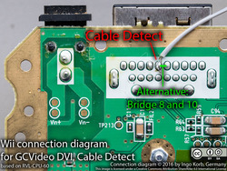
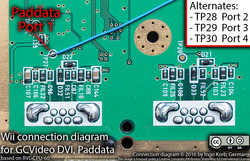

# GCVideo DVI for Wii #

## Warnings ##

It is not recommended to make this modification.

The Gamecube and Wii versions of GCVideo require different FPGA
contents. Although at first glance it may appear that using one
version on the other console works, there will be reliability problems
and you will likely have distorted audio. The correct files for the
Wii version are named `gcvideo-dvi-p2xh-wii-...`

Unlike the Gamecube, the digital video signals were never meant to
drive an external circuit. They are even more sensitive to noise and
other issues by long wires or interference between wires.

Beware of difference in Wii board revisions! The provided images are
from an RVL-CPU-60 board, I have not checked if they can be used as-is
for other Wii revisions.

## Connections ##

The connection information in this document uses the pin numbers
printed on the Pluto IIx HDMI board (which are the FPGA's pin numbers
in case you want to design your own PCB). You can use this picture of
the Pluto IIx board as a guide:

All Wii board pictures used in this document show places on the bottom
of the Wii's board.

### DDC resistor ###

The Pluto IIx HDMI board also has a design flaw that reduces its
compatibility with various displays significantly. To rectify this
problem, you need to connect a 100 ohm resistor from the solder pad
behind the HDMI connector (labelled *DDC +5V* on the bottom) to the
*VUNREG* pin at the side of the board. Please make absolutely sure that
you do not create a short between *VUNREG* and *VCC* when you do this as
this will likely destroy both the FPGA board and the Gamecube it is
attached to.

Without this resistor, most of my monitors and other devices with an
HDMI input claimed that they were receiving no signal from the Pluto
board, even though it was actually generating a valid video signal.

Some people have reported that most of their TVs did not recognize the
signal from the Pluto board with the 100 ohm resistor installed. If
you also suffer from this problem, first check that the resistor you
installed is really a 100 ohm resistor and not a 100 kiloohm
resistor. You can also try to use a direct wire connection from *VUNREG*
to *DDC +5V* instead of a resistor, but this is not recommended.

### Power ###

The Pluto IIx HDMI should be powered from a 5V source in the
Wii. There are some convenient, labelled test points on the Wii
which need to be connected to the *UNREG* (5V) and *GND* (GND) pins on the
Pluto board as shown in the picture above. The picture below shows the
test points on the bottom side of the Wii's circuit board:

Using slightly thicker wires for 5V and GND or connecting multiple
wires in parallel as seen for GND on the picture may improve
reliability.

You can use 5V and GND from the USB connectors of the Wii as
alternates to these points, but unfortunately I forgot to take a
picture of them.

### Digital audio and video ###

The Wii does not feature an easily-accessible connector for its
digital A/V bus, so connections must be made directly to the pins of
the AVE-RVL chip or vias that the signals are connected to. The
following diagram shows both alternatives:

On the Pluto side, the signals connect to the following pins:

Signal name | Pluto | AVE-RVL | Via letter | Note
----------- | ----- | ------- | ---------- | ----
VData 0     | 16    | 64      | 0          |
VData 1     | 15    | 1       | 1          |
VData 2     | 13    | 2       | 2          |
VData 3     | 12    | 3       | 3          |
VData 4     | 10    | 6       | 4          |
VData 5     | 9     | 7       | 5          |
VData 6     | 6     | 13      | 6          |
VData 7     | 5     | 14      | 7          |
CSel        | 19    | 11      | C          |
54 MHz      | 89    | 8       | M          | or TP232
AData       | 3     | 29      | A          |
BCLK        | 4     | 31      | B          |
LRCK        | 98    | 27      | L          |

### Cable detect ###

Similar to the Gamecube, the Wii checks a pin on its video port to
determine if a cable suitable for 480p output is currently
connected. You have three options for this:

- plug in a component cable into the Wii's AV port: Simple and
    effective, but leaves an unused cable behind your Wii
- hard-wire it with a solder bridge: Still simple and it should not
    cause any issues because you can still disable 480p using the
    Wii's setting menu. To do this, you need to bridge pin 8 and 10 of
    the AV connector on the wii, as shown by a small green bar in the
    image below.
- let GCVideo control the signal: If you connect the cable detect pin
    shown in the image below to *pin 20* of the Pluto board, you can use
    the OSD to choose if the Wii should see a 480p-capable cable or
    not. This method is not recommended because there is a risk of
    damaging the chip on the Pluto board if a cable is connected to
    the Wii's AV port.

### Controller ###

If you want to use a Gamecube controller for navigating the GCVideo
OSD, you need to make a connection between TP27 of the Wii board and
*pin 94* of the Pluto board:

Alternatively, you can use TP28/29/30 on the Wii board to read the
controller in port 2/3/4 instead.

If you do not want to use a Gamecube controller to navigate the
GCVideo OSD, *pin 94* of the Pluto board **must** be connected to *GND*.

### SPDIF, IR remote ###

The SPDIF output and IR receiver are the same for both Wii and
Gamecube, so please check the [main README](README.md) for details on
connecting them.

