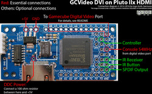
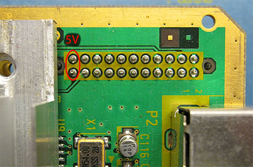
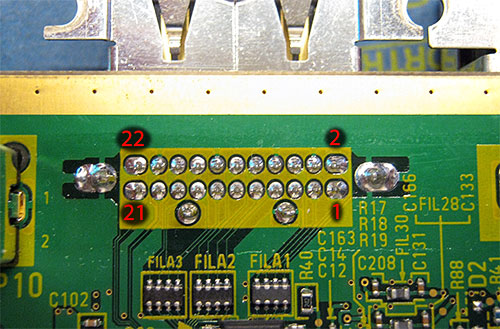
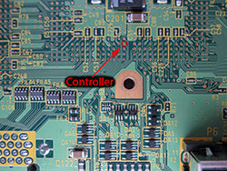

# GCVideo DVI #

## Introduction ##

GCVideo DVI interfaces from the signals on the Digital Video Port of
the Gamecube to a DVI video signal. It currently targets the Pluto
IIx HDMI FPGA board from [KNJN](http://www.knjn.com) as the board is
easily available and small enough to integrate it in the existing
Gamecube casing.

For those who don't mind extremely fine pitch soldering, a Wii version
is also available.

## Features ##

- direct digital video output with no analog intermediate for best
    quality
- optional linedoubler to convert 240p/288p/480i/576i modes to
    480p/576i
- optional scanline overlay with selectable strength
- SPDIF digital audio output
- user-friendly on-screen configuration
- on-screen menus controlled with a Gamecube controller or an IR
    remote

## Limitations ##

- Linedoubling of 480i/576i modes looks very ugly, if your display
    accepts these modes directly, it is recommended to not use
    linedoubling for them.
- Only works on DOL-001 Gamecubes, which are the ones that still have
    the digital video port. It may or may not be possible to adapt the
    project to DOL-101 systems with some changes in the source code, but
    as I do not have access to such a Gamecube I cannot provide help
    with that at this time.

## Requirements ##

- Pluto IIx HDMI FPGA board
- programmer suitable for this board, e.g. KNJN TXDI interface or a
    JTAG programmer with software that can handle a Spartan 3A
- 100 ohm resistor, watt rating does not matter

## Directory structure ##

There are four subdirectories:

- `src` contains the VHDL sources and Xilinx ISE project files
- `bin` contains the synthesized bit stream in various formats
- `doc` contains a few images showing the necessary connections
- `codegens` contains two code generators that generate VHDL source
    for two ROMs in the enhanced DVI encoder

## Programming the board ##

The board can be programmed either before or after
installation. Programming it before installation requires an external
power supply, programming it after installation may make it harder to
access the required pins.

The recommended way to program the board is to use one of the TXDI
interfaces available from KNJN and their FPGAconf program. This also
requires an RS232 port ("COM port"), although there is at least one
TXDI interface that integrates an RS232-to-USB converter. In FPGAconf,
you need to use the "Program boot-PROM" button and select the
`gcvideo-dvi-p2xh-gc-2.3.bit` file from the `bin` subdirectory.

Another option to program the board is over the JTAG pins. This is
only recommended for advanced users and requires a JTAG interface with
software that is either able to use indirect programming of an SPI
flash chip connected to a Spartan 3A (e.g. Xilinx's own Impact) or
that can play an SVF file. Please not that I did not have much success
with the SVF file route yet. This way of programming the SPI flash on
the board requires the `gcvideo-dvi-p2xh-gc-2.3-spiprom.mcs` or
`gcvideo-dvi-p2xh-gc-2.3-m25p40.svf` files in the `bin` subdirectory,
depending on the software you use. The SVF file has been created
assuming that there is a M25P40 chip on the board. KNJN does not
specify which chip they ship, only that it will be at least 4 MBit in
size - if your board has a different flash chip (located on the bottom
side), contact me and I'll try to generate an SVF for it if it's
supported by Xilinx' tools.

KNJN now also sells a version of the board preprogrammed with
GCVideo-DVI, but unfortunately they do not specify which version they
provide.

## Connecting the board to a Wii ##

Use of GCVideo-DVI on a Wii is not recommended since the installation
requires very fine-pitch soldering. The connection information is
available in a [separate file](README-Wii.md).

## Connecting the board to a Gamecube ##

Multiple connections need to be made from the Gamecube to the Pluto
IIx HDMI board to connect all the signals and power lines necessary to
convert the video signal. The image below shows roughly where each of
the connections need to be made on the Pluto board (click for a larger
version):

### Power ###

The Pluto IIx HDMI board must be connected as described below to the
digital video connector of the Gamecube. In addition to the signals
available on that connector, it also needs to be powered from the 5V
power rail of the Gamecube, which is not available on the digital
video port. Instead, 5V can be sourced from the internal power
connector as shown in the image below:

Either of the marked pins (they are already connected together on the
Gamecube's board) must be connected to the *VUNREG* solder pad on the Pluto
board. If the image is unclear, the two 5V pins of the power connector
are the two pins closest to the heat sink.

### DDC resistor ###

The Pluto IIx HDMI board also has a design flaw that reduces its
compatibility with various displays significantly. To rectify this
problem, you need to connect a 100 ohm resistor from the solder pad
behind the HDMI connector (labelled *DDC +5V* on the bottom) to the
*VUNREG* pin at the side of the board. Please make absolutely sure that
you do not create a short between *VUNREG* and *VCC* when you do this as
this will likely destroy both the FPGA board and the Gamecube it is
attached to.

Without this resistor, most of my monitors and other devices with an
HDMI input claimed that they were receiving no signal from the Pluto
board, even though it was actually generating a valid video signal.

Some people have reported that most of their TVs did not recognize the
signal from the Pluto board with the 100 ohm resistor installed. If
you also suffer from this problem, first check that the resistor you
installed is really a 100 ohm resistor and not a 100 kiloohm
resistor. You can also try to use a direct wire connection from *VUNREG*
to *DDC +5V* instead of a resistor, but this is not recommended.

### Gamecube digital port ###

Most of the connections from the Gamecube's digital video port are
made to the contact row opposite of the HDMI connector. Since
connectors for the digital video port are unfortunately not available,
the connections need to be made by soldering to the Gamecube's main
board. The image below shows the pin numbering of the digital video
connector as viewed from the bottom(!) of the board. If you have
decided to desolder that connector and connect the signals from the
top instead, you should find the numbers "1", "2", "21" and "22" in
the silkscreen near the connector which can be used as a guide instead.

13 signals need to be connected from the digital video port to the
Pluto board. Please make sure that the wires are kept short as you are
dealing with high-speed digital signals here. The pins on the Pluto
board are labelled on both the top and bottom sides.

Gamecube DV   | Pluto         | Signal
------------- | ------------- | -------------
1             | 20            | Cable detect
3             | 19            | Color select
4             | GND           | Ground (recommended point: next to VUNREG/VCC)
7             | 16            | VData 0
9             | 15            | VData 1
10            | 13            | VData 2
12            | 12            | VData 3
13            | 10            | VData 4
15            | 9             | VData 5
16            | 6             | VData 6
18            | 5             | VData 7
19            | 98            | LRCK
20            | GND           | Ground (recommended point: next to 89)
21            | 3             | AData
22            | 4             | BCLK
2             | 89            | 54 MHz

Please note that the last signal in that table is not on the same edge
of the Pluto board as the others. It is a rather fast clock signal and
it is strongly recommended to route it separately from the other wires
as bundling them up can lead to flickering pixels.

### Controller ###

To read the controller buttons, another wire must be connected from
the FPGA board to the Gamecube. The recommended connection point for
this is on the bottom of the Cube's PCB, it must be connected
to *pin 94* on the Pluto FPGA board.

If you do not want to wire up the controller, e.g. if you want to use
an IR remote for navigating the OSD, please connect *pin 94* of the
Pluto board to a GND pad.

### SPDIF output ###

The SPDIF output is on *pin 78*. It is **not** suitable for direct connection
to a coaxial SPDIF input.

To connect the SPDIF pin to your audio device without killing the
FPGA, please use either one of the buffer circuits shown
[here](http://www.hardwarebook.info/S/PDIF_output) or use a
3.3V-compatible optical Toslink transmitter, for example a Lite-On
LTDL-TX12P03, Everlight PLT133 or something from the Toshiba TOTX series.

Please note that due to hardware constraints the SPDIF signal has a
small amount of jitter. In my tests this has not resulted in any
compatibility or audio-quality problems, but if you happen to
encounter a device that has issues with the SPDIF signal generated by
GCVideo, there is probably not much that can be done about it.

### IR receiver and IR button ###

The OSD of GCVideo can be controlled either with a Gamecube controller
or with an infrared remote that uses the NEC protocol (same one as
supported by OSSC). The buttons used by GCVideo can be freely chosen,
as long as the remote supports this protocol.

To use this functionality, two pieces of additional hardware are
needed: A button (momentary contact, normally open) and an IR receiver
module that can operate at 3.3V. It has been successfully
tested with an OS-Opto OS-838G as well as a Vishay TSOP4838 IR
receiver module, but it should also work with similar 3-pin IR
receivers that are meant for receiving consumer IR signals with a
modulation frequency between 36 and 40 kHz.

Such a receiver module needs power for its internal circuits. A
convenient place to power it from are the pads labelled "GND" and
"VCC" near the short edge of the Pluto board. Please make sure to read
the data sheet of your IR receiver module to figure out which of its
pin are used to power it. The third pin is the data output, which
needs to be connected to *pin 85* on the Pluto board.

In addition to the IR receiver module, a simple button is required
which connects between *GND* and *pin 83* on the Pluto board, which
will be called "IR button" in this manual. This button allows you to
choose which buttons of your IR remote you want to use to control
GCVideo without getting in a chicken-and-egg situation.

## OSD ##

It is possible to navigate in the OSD with both a Gamecube controller
and an IR remote, even at the same time.

### Using with a controller ###

The on-screen display uses the controller in port 1. It has only been
tested with a genuine Nintendo controller and a Hama clone pad. As I
do not have any other Gamecube controllers, I have no idea what will
happen if you for example connect a Bongo controller instead.

To activate the OSD, hold the L, R, X and Y buttons down until the
menu appears - this should take about one second. If you also hold
down the start button together with these four, all setting will be
returned to their default values.

The OSD is controlled using the D-pad and the X and Y buttons. The X
button activates a menu item, the Y button jumps back to the previous
menu if you are in a submenu or closes the OSD completely if you use
it on the main menu. Please be aware that the Gamecube will still
receive all inputs even when the OSD is active! This can be
problematic for example on the boot screen of the Gamecube because the
cube will rotate doe to the D-pad inputs. If you want to use the OSD
on the Gamecube's main menu, you can do so without causing
interference by going into the cube's option menu first.

### Using with an IR remote ###

To keep the code simple, GCVideo only needs six buttons on an IR
remote. The first four of them have been named "Up", "Down", "Left"
and "Right" which allow navigation in the menus just like the D-Pad on
a Gamecube controller. The other two are "Enter" and "Back", which are
used to enter or leave submenus, similar to the X and Y buttons when
a Gamecube controller is used for navigating the OSD.

Since there are no interferences between the Ir remote and a game
running on the system, calling up the main menu with an IR remote just
needs a press on the "Enter" button instead of a complicated button
combination. You can also hold down the IR button when you enter the
main menu of GCVideo's OSD to reset all settings except the remote
button assignments to their defaults.

#### Button configuration ####

Since I don't know what remote you want to use with GCVideo, it can be
configured to accept any IR remote buttons as long as the remote uses
the so-called NEC protocol. To enter the button configuration screen,
hold down the button connected to pin 83 of the Pluto board ("IR
button") until the configuration screen appears.

On the configuration screen, you need to push six buttons on your
remote for each of the functions highlighted on the screen, one after
the other. GCVideo will tell you if you accidentally try to assign the
same button to two different functions. If a button press is not
acknowledged with either "Ok" or "Dupe" on this screen, the remote you
are trying to use might not be compatible (or you have a wiring error
or my code is too strict).

If you decide to abort the button assignment, hit the IR button once
to restore your previous button configuration.

The IR remote button assignments are saved together with all the other
settings when you select "Save settings" on the main menu.

### General OSD usage ###

GCVideo remembers six sets of settings, one for each basic video mode
(240p, 288p, 480i, 576i, 480p, 576p). When you enter the OSD, the
current mode is shown on the first line and the exact input and output
resolutions are shown in the bottom right corner of the menu.
The linedoubler- and scanline-settings on the main menu always change
the settings for the current mode, if you want to change the settings
for a mode that is not currently displaying, use the "View all
modes..." menu item.

The OSD pops up a box with the current resolution in the top right
corner showing the current resolution for five seconds. If you think
this box is annoying, you can disable it in the "OSD settings"
submenu, where you can also choose the transparency and tint of the
OSD windows.

If in doubt, experiment with the settings. You can always reset to the
defaults by using L+R+X+Y+Start to call up the OSD menu. This reset
function is temporary - if you want to revert setting that have been
stored, make sure to use the "Store settings" menu item.

### Picture Settings ###

The Picture Settings submenu has controls to change the brightness,
contrast and saturation of the picture.

Each of the controls has a range from -128 to +127. When all
three controls are set to 0, the picture is output exactly as produced
by the console, without any modification. The picture settings are
saved together with all the other settings by selecting "Store
settings" in the main menu.

Please note that some extreme combinations of settings in this menu
can result in errorneous color output, e.g. bright white flipping to
black or shifted tint in highly-saturated colors. If you encounter
this, the recommended workaround is to use less extreme picture
settings in GCVideo, prefereably neutral.

### Other settings submenu ###

In the "Other settings" submenu, you can enable or disable a few
additional settings. All of these settings are independent of the
current video mode and can be stored permanently using the "Store
settings" menu item in the main menu.

The first setting selects whether GCVideo should
tell the Gamecube that a 480p-capable cable is connected. By default
it is enabled and unless you know what you are doing, there is little
reason to disable it.

The second option selects if GCVideo should output full-range
or limited-range RGB levels. Full-range is usually
associated with computer graphics and limited-range with TV
signals. The default is full-range as GCVideo outputs a DVI signal
where full-range RGB is more common.

The third option enables enhanced DVI mode. Since this mode may not be
acceptable to all displays, it is disabled by default. If it is on,
GCVideo transmits additional data to the display to signal the current
video mode. Enabling this option may increase compatibility with some
displays, especially in non-linedoubled 480i/576i modes.

When enhanced DVI mode is enabled, the `Display as 16:9` option
becomes available. If it is turned on, GCVideo tells the monitor that
it should display the image in widescreen format (16:9 aspect ratio),
if it is off then the display is told that standard format (4:3 aspect
ratio) is preferred. The default setting is 4:3, since most Gamecube
games assume this as standard, but some have an option to switch to
widescreen. Please note that this setting may not do anything as some
displays ignore the aspect ratio information sent by GCVideo.

Another option in this submenu is `Mode switch delay`. If it is set
to zero (the default value), it is inactive. Otherwise, the number set
in this option controls for how many frames GCVideo should completely
disable its output when the Gamecube changes to a different
resolution. This has been found useful for a small number of displays
which did not correctly recognize a change in resolution, for example
when a game switches to progressive mode while it boots. If your
display has such problems, you could try to set this option to 10 or
50 - higher values disable the output for a longer time and a value of
50 or 60 (PAL or NTSC) corresponds to one second. Trying every single
number in this option will generally be useless - instead try a
relatively high value and work your way back to zero to find a setting
that is high enough so your display recognizes the mode change, but
that also blanks your screen for as short a time as possible. It is
expected that few to no displays that can accept enhanced DVI mode
will need a setting other than 0 for the mode switch delay, but this
has not yet been comprehensively tested.

(TLDR: Set `Mode switch delay` to 255 for a Framemeister-like
experience during video mode changes ;) )

Finally, the audio volume can be lowered in this menu. The option
`Volume` can be set between 0 (silent) and 255 (original volume) and
the `Mute` option can be used to turn off the sound completely without
changing the current Volume setting. Please note that this setting
uses a simple multiplication of sample values to lower the volume
which means that any setting except 255 reduces audio quality
slightly. Also, it only changes ony the volume of the audio outputs of
GCVideo, but not the volume at the Gamecube's Analog AV output.

## Possible issues ##

1. The enhanced DVI mode may not be compatible with all displays,
    especially if they expect pure DVI signals.

2. Some displays do not expect to receive consumer video-style timings
    (as opposed to computer-style timings)
    as a DVI signal, which may result in various display problems.
    Enabling enhanced DVI mode may or may not help. Alternatively, you
    can try enabling the line-doubler for any modes that your display
    refuses to accept, although the signal timing is still not
    completely identical to a computer video signal.

3. If your display completely refuses to accept the signal generated
    on the Pluto IIx board, you may have a problem with the 100 ohm
    DDC resistor (see section "DDC resistor" above). In some cases
    this can be fixed by using a wire instead of a resistor, although
    this is not recommended unless absolutely neccessary.

If everything is wired correctly, at least one of the two LEDs on the
Pluto board should blink at a regular rate. The second LED also blinks
(at a different rate) in the Gamecube version or shows the current
console mode (Wii or Gamecube) in the Wii version.
If neither of them is blinking, check all the wiring and also
make sure that the board is actually programmed.

The blink pattern of the LEDs is based on both the master 54MHz clock
and the VSync signal. With two heartbeat LEDs, one of them shows
the presence of the 54MHz clock by pulsing approximately 3 times per
second with a short on/long off pattern. The second LED shows the
presence of a VSync signal (decoded from the digital video bus) by
blinking at about 0.5 Hz with an NTSC video signal or slightly slower
with a PAL signal - this means that it should be on for about one
second, then off for about one second and so forth.

If only a single heartbeat LED is available, it shows the quick
pulsing of the clock heartbeat pattern, but the short on/long off
pattern is changed to a short off/long on pattern and back about every
second if VSync signals are detected. (Or more technical, the clock
heartbeat pattern is XORed with the VSync pattern, so every second
second the pattern is inverted)

### XRGB Mini ###

If possible, avoid connecting the output of GCVideo DVI to the HDMI
inputs of an XRGB Mini. Although you will usually get a picture, the
XRGB Mini seems to show various issues with the signal from GCVideo
DVI. For example, the image may be shifted to the far left of the
screen with no option to adjust it.

With certain games the switch from interlaced to progressive mode when
the game boots causes the XRGB Mini to misdetect the new video mode,
halving the horizontal resolution (360x480 instead of
720x480). Switching to a different input and back should trigger a
re-detection of the input video mode and usually results in the
correct resolution. Enabling enhanced DVI mode may also fix this issue.

### Elgato Game Capture HD ###

When the linedoubler is enabled for 480i/576i modes and scanlines are
enabled, the Elgato Game Capture HD shows reduced color saturation in
every second captured frame. The amount of desaturation depends on the
strength of the scanlines, up to a fully black-and-white picture if
the maximum scanline strength is used.

### Other issues ###

Notes about other issues will be added as time permits.

## Running synthesis ##

There is a Xilinx ISE project file in the `src` subdirectory if you
want to use Project Navigator. Alternatively, you can run the full
synthesis and bitstream generation steps using the `Makefile` in this
directory. It has only been tested on Linux and assumes that the
Xilinx synthesis tools are reachable via the `PATH` environment
variable. The output as well as all temporary files will be stored in
the subdirectory `build`.

## Firmware sources ##

The firmware sources can be found in the [Firmware](../../Firmware)
directory at the top level of the repository.

## Alternative target boards ##

GCVideo-DVI should be easily portable to other FPGA boards that have a
DVI or HDMI connector directly connected to the FPGA's pins and use a
Spartan 3A-200 (or larger) or a Spartan 6 (necessary size unknown,
probably a 9 minimum). Ports to FPGAs from other vendors should be
possible, only the clock generator and DDR outputs use Xilinx-specific
components.

At least one alternative board has been designed, the [Shuriken
Video](http://www.retro-system.com/shuriken%20video.htm). It
features a smaller footprint which is optimized for mounting it so
that it sticks out of the original digital video connector hole of the
Gamecube. The developer has used a smaller FPGA to keep the costs
down, but it should be possible to use a Spartan 3A-200 and port the
current version of GCVideo-DVI by just changing the pin assignments
and re-synthesizing.

## Credits ##

Thanks to:

- Mike Field for releasing his [DVI encoder](http://hamsterworks.co.nz/mediawiki/index.php/Dvid_test) under an open-source license
- bobrocks95 on gc-forever for pointing me towards the Pluto IIx HDMI board
- Artemio for his incredible [240p test suite](http://junkerhq.net/xrgb/index.php/240p_test_suite) which has been extremely
    useful for quickly switching between modes during development
- Nintendo for filing such a detailed patent for their console
- Alastair M. Robinson for the ZPUFlex core
- meneerbeer on the gc-video forums for suggesting a simple fix that reduces occasional image corruption and the 16:9 option
- Antti Siponen for his hdmi_proto project, which was really useful
    for figuring out many details about data transmission during blanking
- Andrew "bunnie" Huang for releasing the NeTV code, which was a
    very helpful code base for hacking a simple DVI signal analyzer
- Alexios Chouchoulas for [mcasm](http://www.bedroomlan.org/projects/mcasm)

## Changes ##

Version 1.0 - initial release
Version 1.1 - added OSD and SPDIF output
Version 1.2 - improved pad snoop timing
Version 1.3 - improved SPDIF compatibility
Version 2.0 - Enhanced DVI mode
