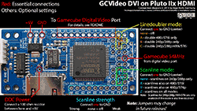

# GCVideo DVI #

## Introduction ##

GCVideo DVI interfaces from the signals on the Digital Video Port of
the Gamecube to a DVI video signal. It currently targets the Pluto
IIx HDMI FPGA board from [KNJN](http://www.knjn.com) as the board is
easily available and small enough to integrate it in the existing
Gamecube casing.

## Features ##

- direct digital video output with no analog intermediate for best
    quality
- optional linedoubler to convert 240p/288p/480i/576i modes to
    480p/576i
- optional scanline overlay with selectable strength

## Limitations ##

- DVI only, even though the FPGA board has "HDMI" in its name because
    the HDMI specification is not available to the public.
    This can in some cases reduce the compatibility with certain
    displays because modes below 480p are not officially part of the
    DVI specification.
- no audio support, although an SPDIF output is under consideration  
    (coming with a future update that will simplify the configuration jumpers)
- Linedoubling of 480i/576i modes looks very ugly, if your display
    accepts these modes over DVI it is recommended to not use
    linedoubline for them.
- Only works on DOL-001 Gamecubes, which are the ones that still have
    the digital video port. It may or may not be possible to adapt the
    project to DOL-101 systems with some changes in the source code, but
    as I do not have access to such a Gamecube I cannot provide help
    with that at this time.

## Requirements ##

- Pluto IIx HDMI FPGA board
- programmer suitable for this board, e.g. KNJN TXDI interface or a
    JTAG programmer with software that can handle a Spartan 3A
- 100 ohm resistor, watt rating does not matter

## Directory structure ##

There are three subdirectories:

- `src` contains the VHDL sources and Xilinx ISE project files
- `bin` contains the synthesized bit stream in various formats
- `doc` contains a few images showing the necessary connections

## Programming the board ##

The board can be programmed either before or after
installation. Programming it before installation requires an external
power supply, programming it after installation may make it harder to
access the required pins.

The recommended way to program the board is to use one of the TXDI
interfaces available from KNJN and their FPGAconf program. This also
requires an RS232 port ("COM port"), although there is at least one
TXDI interface that integrates an RS232-to-USB converter. In FPGAconf,
you need to use the "Program boot-PROM" button and select the
`gcvideo-dvi-p2xh-1.0.bit` file from the `bin` subdirectory.

Another option to program the board is over the JTAG pins. This is
only recommended for advanced users and requires a JTAG interface with
software that is either able to use indirect programming of an SPI
flash chip connected to a Spartan 3A (e.g. Xilinx's own Impact) or
that can play an SVF file. Please not that I did not have much success
with the SVF file route yet. This way of programming the SPI flash on
the board requires the `gcvideo-dvi-p2xh-1.0-spiprom.mcs` or
`gcvideo-dvi-p2xh-1.0-m25p40.svf` files in the `bin` subdirectory,
depending on the software you use. The SVF file has been created
assuming that there is a M25P40 chip on the board. KNJN does not
specify which chip they ship, only that it will be at least 4 MBit in
size - if your board has a different flash chip (located on the bottom
side), contact me and I'll try to generate an SVF for it if it's
supported by Xilinx' tools.

If you plan to buy a Pluto IIx HDMI specifically to use it with a
Gamecube, you could try to ask the vendor if they can ship it
pre-programmed. I have no idea if they are willing to do it and this
paragraph may vanish in later versions of this file if this option
turns out to be unavailable.

## Connecting the board ##

Multiple connections need to be made from the Gamecube to the Pluto
IIx HDMI board to connect all the signals and power lines necessary to
convert the video signal. The image below shows roughly where each of
the connections need to be made on the Pluto board (click for a larger
version):

### Power ###

The Pluto IIx HDMI board must be connected as described below to the
digital video connector of the Gamecube. In addition to the signals
available on that connector, it also needs to be powered from the 5V
power rail of the Gamecube, which is not available on the digital
video port. Instead, 5V can be sourced from the internal power
connector as shown in the image below:

Either of the marked pins (they are already connected together on the
Cube's board) must be connected to the VUNREG solder pad on the Pluto
board. If the image is unclear, the two 5V pins of the power connector
are the two pins closest to the heat sink.

### DDC resistor ###

The Pluto IIx HDMI board also has a design flaw that reduces its
compatibility with various displays significantly. To rectify this
problem, you need to connect a 100 ohm resistor from the solder pad
behind the HDMI connector (labelled "DDC +5V" on the bottom) to the
VUNREG pin at the side of the board. Please make absolutely sure that
you do not create a short between VUNREG and VCC when you do this as
this will likely destroy both the FPGA board and the Gamecube it is
attached to.

Without this resistor, most of my monitors and other devices with an
HDMI input calimed that they were receiving no signal from the Pluto
board, even though it was actually generating a valid video signal.

### Gamecube digital port ###

Most of the connections from the Gamecube's digital video port are
made to the contact row opposite of the HDMI connector. Since
connectors for the digital video port are unfortunately not available,
the connections need to be made by soldering to the Gamecube's main
board. The image below shows the pin numbering of the digital video
connector as viewed from the bottom(!) of the board. If you have
decided to desolder that connector and connect the signals from the
top instead, you should find the numbers "1", "2", "21" and "22" in
the silkscreen near the connector which can be used as a guide instead.

13 signals need to be connected from the digital video port to the
Pluto board. Please make sure that the wires are kept short as you are
dealing with high-speed digital signals here. The pins on the Pluto
board are labelled on both the top and bottom sides.

Gamecube DV   | Pluto         | Signal
------------- | ------------- | -------------
1             | 20            | Cable detect
3             | 19            | Color select
4             | GND           | Ground (recommended point: next to VUNREG/VCC)
7             | 16            | VData 0
9             | 15            | VData 1
10            | 13            | VData 2
12            | 12            | VData 3
13            | 10            | VData 4
15            | 9             | VData 5
16            | 6             | VData 6
18            | 5             | VData 7
20            | GND           | Ground (recommended point: next to 89)
2             | 89            | 54 MHz

(FIXME: Decide on points for the digital audio signals)

Please note that the last signal in that table is not on the same edge
of the Pluto board as the others. It is a rather fast clock signal and
it is strongly recommended to route it seperately from the other wires
as bundling them up can lead to flickering pixels.

## Jumper settings ##

Currently there are three jumpers available for changing video
processing options. The jumpers can be changed while the system is
powered and take effect immediately (if a suitable video mode is
active). For a graphical representation of the jumpers, see the 

Jumper settings may change in future releases!

### Linedoubler mode ###

The first jumper controls the modes that are affected by the line
doubler and is located on the pads numbered 4, 94 and 98. If none of
them is connected, the line doubler is disabled. To enable the line
doubler, connect exactly one of them to the central GND pad:

- 4: connecting pad 4 to GND enables linedoubling only for 480i and 576i
    modes
- 98: connecting pad 98 to GND enables linedoubling only for 240p and 288p
    modes
- 94: connecting pad 94 to GND enables linedoubling for 240p, 288p, 480i
    and 576i modes

Note: 480p and 576p modes are never linedoubled.

Please be warned that linedoubling 480i/576i video signals is intended
only as a method of last resort - the video quality suffers
significantly compared to proper deinterlacing, which cannot be
implemented on the Pluto board for lack of memory. If these modes are
linedoubled, expect to see additional flickering and jaggies.

### Scanline mode ###

The second jumper controls which video modes are affected by the
scanline overlay. Scanlines can only be added to 240p/288p/480i/576i
modes if the linedoubler is also enabled for them. The scanline mode
jumper is located on pads 84, 83 and 77. Scanlines are always added to
(line-doubled) 240p/288p modes, no matter what the setting of this
jumper is. If you want to completely disable scanlines, remove the
scanline strength jumper (described below). To enable the scanline
overlay for other modes, connect exactly one of the three pads to the
central GND pad:

- 84: connecting pad 84 to GND enables the scanline overlay only for
    240p/288p and 480i/576i modes (if they are line-doubled)
- 83: connecting pad 83 to GND enables the scanline overlay only for
    240p/288p (if line-doubled) and 480p/576p modes (always)
- 77: connecting pad 77 to GND enables the scanline overlay for all modes

The scanline overlay for 480i/576i alternates the line on which the
overlay is shown in every field, which simulates the display process
on a CRT. This causes some additional flicker, but increases the
percieved sharpness of the picture, effectively turning your eyes into
a deinterlacer. ;)

### Scanline strength ###

The third jumper controls the strength of the scanline overlay. If it
is not connected, the scanline overlay is disabled, no matter what the
scanline mode jumper is set to. There are currently 9 selections for
the scanline strength available, which is selected by connecting one
of the pads 60/61/62/64/65/70/71/72/73 (the entire row besides the
HDMI connector) to a GND pad. Pad 60 enables the highest scanline
strength, pad 73 the lowest.

## Possible issues ##

GCVideo DVI only generates a DVI signal, not an HDMI signal. This has
two important consequences:

1. There is no audio embedded in the video signal, a seperate
    connection is required to get sound. Currently the only option is
    to use the analog audio produced by the Gamecube, although adding
    an SPDIF output to GCVideo DVI is currently under consideration.

2. Some displays do not expect to receive consumer video-style timings
    (as opposed to computer-style timings)
    as a DVI signal, which may result in various display problems. You
    may be able to reduce these problems by enabling the line-doubler
    for any modes that your display refuses to accept, although even
    then the signal timing is still not completely identical to a
    computer video signal.

### XRGB Mini ###

If possible, avoid connecting the output of GCVideo DVI to the HDMI
inputs of an XRGB Mini. Although you will usually get a picture, the
XRGB Mini seems to show various issues with the signal from GCVideo
DVI. For example, the image may be shifted to the far left of the
screen with no option to adjust it.

With certain games the switch from interlaced to progressive mode when
the game boots causes the XRGB Mini to misdetect the new video mode,
halving the horizontal resolution (360x480 instead of
720x480). Switching to a different input and back should trigger a
re-detection of the input video mode and usually results in the
correct resolution.

### Elgato Game Capture HD ###

When the linedoubler is enabled for 480i/576i modes and scanlines are
enabled, the Elgato Game Capture HD shows reduced color saturation in
every second captured frame. The amount of desaturation depends on the
strength of the scanlines, up to a fully black-and-white picture if
the maximum scanline strength is used.

### Other issues ###

Notes about other issues will be added as time permits.

## Credits ##

Thanks to:

- Mike Field for releasing his [DVI encoder](http://hamsterworks.co.nz/mediawiki/index.php/Dvid_test) under an open-source license
- bobrocks95 on gc-forever for pointing me towards the Pluto IIx HDMI board
- Artemio for his incredible [240p test suite](http://junkerhq.net/xrgb/index.php/240p_test_suite) which has been extremely
    useful for quickly switching between modes during development
- Nintendo for filing such a detailed patent for their console
